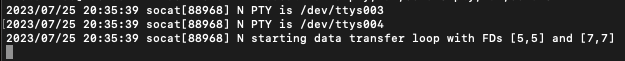

# Serial Port Listener

Serial Port Listener is an application that listens to emulated serial ports and receives messages that it displays on the console.
The program can listen to several serial ports

## Requirements

- **Operative System**:
  - Ubuntu/Debian/CentOS/RHEL/OpenSUSE/macos
- **Java**:
  - [Java Development Kit 8](https://www.oracle.com/mx/java/)
- ***IDE***:
  - [Apache Netbeans](https://netbeans.apache.org/)
- **Serial port emulator**:
  - socat v1.7.4.4 


## Usage
To run the program follow the steps below


- Clone or download repository
- Import project in Apache Netbeans


Open terminal and execute the following command that will create an emulate serial port using socat


```bash
#Emulate Serial port
socat -d -d pty,raw,echo=0 pty,raw,echo=0
```
The previous command will show the information of the ports (two Addresses), this information will be necessary in the following steps.

If you need to create more serial ports, you need to open another terminal and execute the same command, repeat the following steps for each one




- Address A: /dev/ttys003
- Address B: /dev/ttys004

Addresses may be different


In the ide open file /src/AppSettings.properties and copy the Address A in the variable LIST_SERIAL_PORTS 


```properties
# list serial ports separed by comma (,)
# example:  /dev/ttys007,/dev/ttys011,/dev/ttys013,COM
LIST_SERIAL_PORTS=/dev/ttys003
```

Run file src/main/JavaApplication.java, the program will listen to the port and be ready to receive messages.


A log will be displayed on the console informing that the port is open and after 3 seconds, if no message is received from the serial port, the log will be displayed on the console.

```bash
#Listening port
INFO: Puerto: /dev/ttys003 Opened

#Offline device after 3s 
SEVERE: Offline device: /dev/ttys003
```


To send messages to the port open another terminal and send a message with the following command sending the message to address B

- Address B: /dev/ttys004


```bash
#send
echo "3#7A#120" > /dev/ttys004
```

The message will be displayed in the ide console 

```bash
INFO: Tue Jul 25 21:09:27 CST 2023 7A /dev/ttys003 120
```

To send more messages repeat the command, you can send another message by changing the part "3#7A#120"ore messages repeat the command changing 

```bash
"3#7A#120"
```

## Validations
Each message is validated with the following rules

- The message must have the following format: `ID#MESSAGE#CHECKSUM`. Where:
  - `ID`: Number as the identificator for the serial port device. For example: `3`
  - `MESSAGE`: String as identificator for the message sent. It must be a string. For example: `ACK`.
  - `CHECKSUM`: Number as a custom verification sum to validate the integrity of the whole message sent. For example: `122` decimal for `7A` hexadecimal, as result of sum all ASCII of whole previuos characters of message without `#`.
- if the message:
  - Is correctly identified (under communication frame): It must be logged with:
    - Local time
    - Message
    - Device
    - Checksum
  - Is not correctly identified or any error occurs (interruption or incomplete message): It must log an error.
- program detect inactivity from any devicea and show that is offline after `3s`.


## License

[MIT](https://choosealicense.com/licenses/mit/)